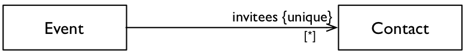
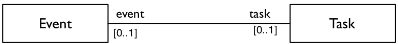
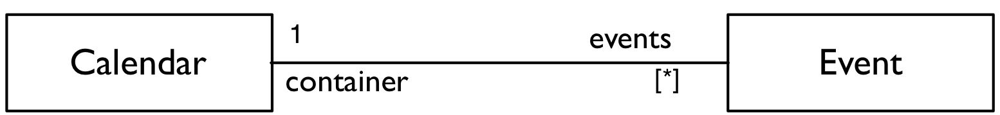

## Association implementation

Use Java to implement three UML association between the class `fr.unantes.software.construction.associations.Event` 
and the classes  `Contact`, `Task`, and `Calendar`.
Use the _Wrapper_ implementation strategy introduced during the lectures. 

Part of the implementation is already done: 
  - There are several unit tests to ensure the correctness of your implementation.
  - There are also 1 java interface implementation for each UML class.
  - There are also two java interfaces to help you implement the associations: `SingleReference` 
  and `MultipleReference`.
  
### Association between Event and Contact

Start with the simpler association. The association between `Event` and `Contact` is unidirectional, all
you have to do is to implement the interface `MultipleReference`, in order to contain several contacts.

### Association between Event and Task

This association is bidirectional and therefore harder to implement.
Your code must ensure the handshake (referential integrity).

You will have to implement the interface `SingleReference` twice: from `Event` to `Task` and from `Task` to `Event`

- Start with the simpler case: a new event (`evt1`) and a new task (`task1`). Ensure that setting the event of 
`task1` to `evt1` is equivalent to setting the task of `evt1` to `task1`.

- Afterwards, take a harder case: a first event (`evt1`) is related to a task (`task1`) and a second event (`evt2`) is
related to a second task (`task2`). Ensure that is you set the task of `evt1` to `task2` (or vice versa):

  - `evt2` will not be related to any task and
  - `taks1` will not be related to any event.
  
### Association between Event and Calendar

This last association is also the most complex. The association between `Event` and `Calendar` is also bidirectional,
but in this case, one of the references is multi-valuated and must implement the interface `MultipleReference`.

### Conclusion

Once all the tests pass, your are done: now you know how to implement UML associations.

Before packing up your things, a let us have some thought: you implemented the same interfaces (`SingleReference` 
and `MultipleReference`) several times: is it possible to generalize your code and use the same class for different 
mono-valued references and the same class for different multi-valued references? 