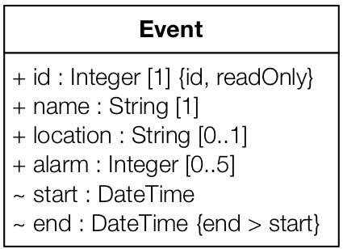

## Attribute implementation

Use Java to implement the UML class `Event` and its attributes. 
Use the Getter/Setter implementation strategy introduced during the lectures.  

Part of the implementation is already done: a Java interface named `Event` and several unit tests (see class `SimpleEventTest`).
There is also a partial implementation of the class `SimpleEvent`. You have to complete this class

  1. First, declare the needed Java fields.
  2. Then, implement the class constructor. Remember that some attributes are mandatory and others are not. The constructor must throw a `IllegalArgumentException` if the arguments are invalid.
  3. After, implement the fields' accessors and modifiers (getters and setters). 
  4. Run all tests. Once all tests pass, you are finished.